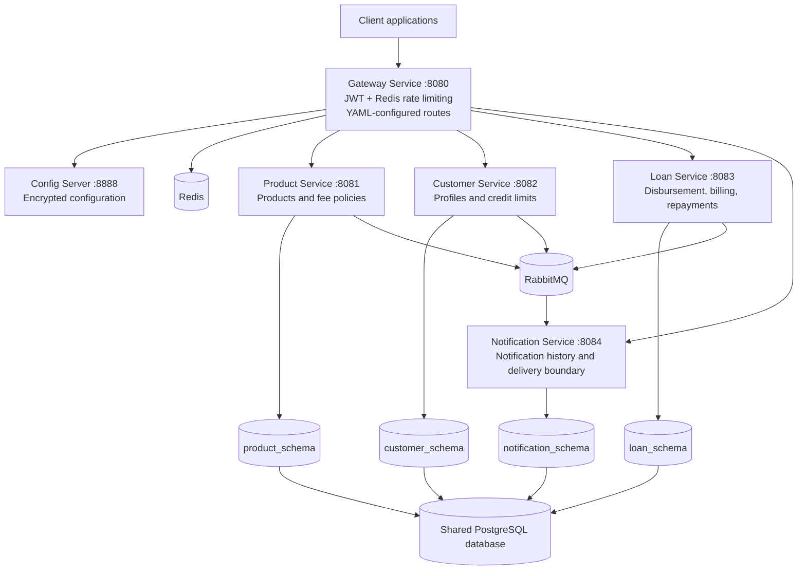
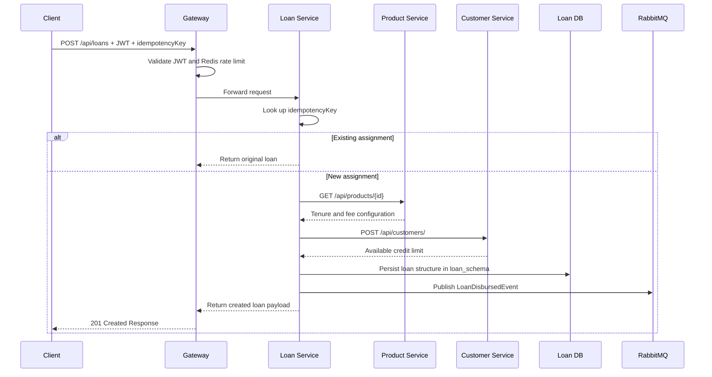

# Tezza Lending Microservices

Production-oriented Spring Boot microservices for product configuration, customer credit limits, loan disbursement, repayments, overdue processing, notifications, and gateway security. The repository root is a Maven aggregator; all runnable applications live under `services/`.

This solution is decomposed into four independently runnable downstream Spring Boot services and one gateway:

| Service | Port | Responsibility |
|---|---:|---|
| Gateway Service | 8080 | Client-facing routing to downstream services |
| Config Server | 8888 | Centralized encrypted configuration |
| Product Service | 8081 | Loan products, tenure, service/daily/late fees |
| Customer Service | 8082 | Customer profiles and available loan limits |
| Loan Service | 8083 | Disbursement, installments, repayments, billing dates, loan states, overdue sweep |
| Notification Service | 8084 | RabbitMQ event consumer and notification history |

All client traffic should enter through Gateway Service at `http://localhost:8080`. The downstream ports remain useful for internal calls and local troubleshooting.

The services use one shared PostgreSQL database with separate service-owned schemas. Product, Customer, Loan, and Notification Services never read or write another service's tables. Product and Customer Services seed demonstrative data at startup. The shared event payloads live in `services/common-contracts` and contain no service domain entities.

---

## API Documentation (Swagger / OpenAPI)

The platform natively uses **Springdoc OpenAPI v3** to generate interactive REST API contracts compatible with Spring Boot 4.x and reactive WebFlux pipelines.

### Core Gateway Aggregator
For ease of testing, you do not need to query each individual microservice portal. The `gateway-service` acts as a **central Swagger UI aggregator**. You can access all downstream microservice definitions from a single dashboard dropdown:
* **Unified UI Dashboard:** `http://localhost:8080/swagger-ui.html`
* **Raw OpenAPI JSON Spec:** `http://localhost:8080/v3/api-docs`

### Service-Specific Documentation Mappings
If troubleshooting internally or accessing services within a Kubernetes cluster setup, use the direct endpoint paths detailed below:

| Microservice | Base Interactive UI URL | Raw JSON Spec Endpoint |
| :--- | :--- | :--- |
| **Gateway Service** (Aggregator) | `http://localhost:8080/swagger-ui.html` | `/v3/api-docs` |
| **Product Service** | `http://localhost:8081/swagger-ui.html` | `/v3/api-docs` |
| **Customer Service** | `http://localhost:8082/swagger-ui.html` | `/v3/api-docs` |
| **Loan Service** | `http://localhost:8083/swagger-ui.html` | `/v3/api-docs` |
| **Notification Service** | `http://localhost:8084/swagger-ui.html` | `/v3/api-docs` |

### Security & Public Routes
The API documentation path layers (`/swagger-ui/**`, `/v3/api-docs/**`, and `/swagger-ui.html`) are explicitly configured as **public routes** inside the reactive Gateway security configuration rules. This enables external clients, frontend developers, and internal testing suites to pull runtime definitions instantly without hitting unauthorized JWT blocks.

---

## Run Everything Local (Docker Compose)

Start the core backing infrastructure first:

```powershell
docker compose up -d
```

Then run each service in a separate terminal from the repository root:

```powershell
.\mvnw.cmd -pl services/gateway-service spring-boot:run
.\mvnw.cmd -pl services/product-service spring-boot:run
.\mvnw.cmd -pl services/customer-service spring-boot:run
.\mvnw.cmd -pl services/loan-service spring-boot:run
.\mvnw.cmd -pl services/notification-service spring-boot:run
```

Set `CONFIG_ENCRYPT_KEY`, `CONFIG_SERVER_PASSWORD`, and `CONFIG_SERVER_USERNAME` before starting Config Server. The service configuration imports Config Server optionally, so local service startup remains possible without it; deployed services should use the Config Server URL and required credentials.

RabbitMQ management is available at `http://localhost:15672` with the default `guest` / `guest` credentials.

Build all modules with:

```powershell
.\mvnw.cmd clean verify
```

Each deployable service has its own Dockerfile. Build from the repository root so Maven can include `common-contracts` without an artifact repository:

```powershell
docker build -f services/product-service/Dockerfile -t tezza/product-service:0.0.1 .
docker build -f services/customer-service/Dockerfile -t tezza/customer-service:0.0.1 .
docker build -f services/loan-service/Dockerfile -t tezza/loan-service:0.0.1 .
docker build -f services/notification-service/Dockerfile -t tezza/notification-service:0.0.1 .
docker build -f services/gateway-service/Dockerfile -t tezza/gateway-service:0.0.1 .
docker build -f services/config-server/Dockerfile -t tezza/config-server:0.0.1 .
```

---

## Kubernetes Deployment (k8s)

The orchestration landscape separates core stateful persistence layers from stateless microservice runtimes to ensure strict lifecycle lifecycle management.

### 1. Pre-deployment Cluster Secrets
Create runtime Secrets once before deploying the main manifests. These are managed outside the repository footprint to avoid security parameter overrides:

```powershell
kubectl create secret generic tezza-runtime-secrets `
  --from-literal=CONFIG_ENCRYPT_KEY="your-encryption-key" `
  --from-literal=CONFIG_SERVER_USERNAME="config-client" `
  --from-literal=CONFIG_SERVER_PASSWORD="secure-password" `
  --from-literal=GATEWAY_JWT_SECRET="at-least-32-characters-jwt-signing-secret"
```

### 2. Stand up Stateful Backing Infrastructure
Deploy the persistent layer containing **RabbitMQ** (with connectivity diagnostic probes) and **Redis** (configured with AOF backup persistence and `PersistentVolumeClaims`):

```powershell
kubectl apply -f infrastructure.yaml
```

### 3. Deploy Platform & Domain Microservices
Deploy the orchestration layer containing the central `ConfigMap` network mappings, `config-server`, `gateway-service`, and the underlying business domains:

```powershell
kubectl apply -f services.yaml
```

*Note: All business microservices feature an active network loop inside `initContainers` that continuously polls `http://config-server:8888/actuator/health` using a lightweight busybox instance, preventing cascading boot crashes if the config server starts slowly.*

---

## Jenkins CI/CD

Each deployable component has its own Jenkinsfile:

```text
services/product-service/Jenkinsfile
services/customer-service/Jenkinsfile
services/loan-service/Jenkinsfile
services/notification-service/Jenkinsfile
services/gateway-service/Jenkinsfile
services/config-server/Jenkinsfile
```

Create six Jenkins Pipeline or Multibranch Pipeline jobs pointing to this GitHub repository and configure each job's Script Path to the corresponding Jenkinsfile. A GitHub webhook should trigger `Generic Webhook Trigger` or the standard multibranch SCM trigger on every push. Each pipeline tests its Maven module, builds from the repository root so `common-contracts` is included, pushes a commit-tagged image, applies Kubernetes/OpenShift resources, updates only its own Deployment, and waits for rollout completion.

Required Jenkins plugins include Pipeline, Git, Credentials Binding, Docker Pipeline, and Kubernetes CLI. Configure these credentials:

- `tezza-registry`: registry username/password.
- `tezza-kubeconfig`: Kubernetes/OpenShift kubeconfig file.

Each Jenkinsfile exposes `IMAGE_REGISTRY`, `KUBERNETES_NAMESPACE`, `KUBECONFIG_CREDENTIALS_ID`, and `REGISTRY_CREDENTIALS_ID` parameters. Store Config Server encryption keys, JWT secrets, and service passwords in Kubernetes/OpenShift Secrets rather than Jenkinsfiles or Git.

## Overarching architecture

Tezza is a service-oriented lending platform with a single client-facing gateway and independently deployable business services. Each business service owns its data and lifecycle rules. `common-contracts` is a build-time Java library containing RabbitMQ event contracts; it is packaged into service images and is not deployed as a runtime service.



### Synchronous request flows

All external requests enter through Gateway Service. The gateway validates the JWT, checks the Redis-backed client rate limit, selects a route from `application.yml`, and forwards the request. Downstream services are cluster-internal and own their persistence.

#### Loan assignment/disbursement

