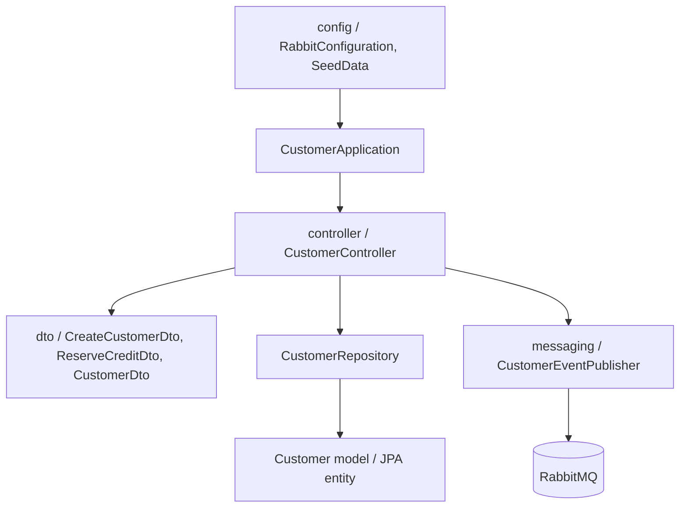

# Customer Service

Owns customer profiles, loan limits, available credit, and credit reservations. It publishes `customer.created` events.

## Run

From the repository root:

```powershell
.\mvnw.cmd -pl services/customer-service spring-boot:run
```

Runs on `http://localhost:8082` and requires RabbitMQ at `localhost:5672`.

## API

- `POST /api/customers` creates a customer.
- `GET /api/customers` lists customers.
- `GET /api/customers/{id}` returns one customer.
- `POST /api/customers/{id}/reserve` reserves available credit for a loan.

## OpenAPI documentation

- Swagger UI: `http://localhost:8082/swagger-ui.html`
- OpenAPI JSON: `http://localhost:8082/v3/api-docs`

The controller uses `@Tag` and `@Operation` annotations to describe customer and credit-limit operations.

## Project structure



The `dto` package protects the customer API from exposing persistence entities as input contracts.

Controllers expose Reactor `Mono` and `Flux` types. Existing JPA calls run on `Schedulers.boundedElastic()` at the persistence boundary; no `CompletableFuture` is used.

## Resources and persistence

- `src/main/resources/application.properties` contains local development, PostgreSQL schema, and RabbitMQ settings.
- `src/main/resources/schema.sql` documents the service-owned table.
- `src/main/resources/data.sql` documents seed ownership.
- Production deployments use the shared PostgreSQL `customer_schema`; local development may use the H2 fallback.
- `SeedData` inserts demonstration customers when the database is empty.
