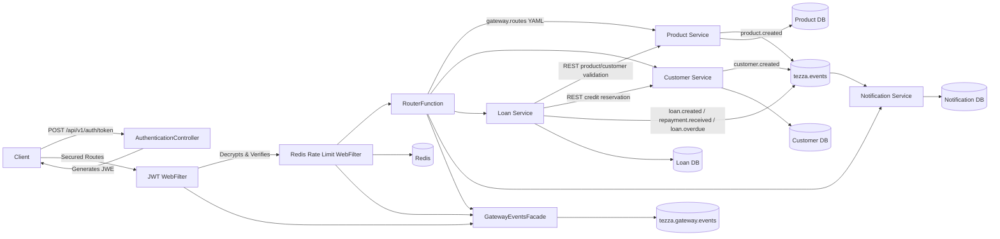
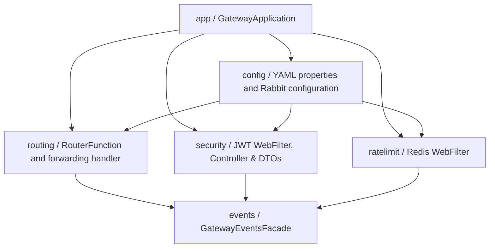

# Gateway Service

The gateway is the single client-facing HTTP entry point for the lending platform. It runs on port `8080` and forwards requests to the downstream services without changing their public `/api/...` paths, while exposing internal authentication management endpoints.

## Run

Start the downstream services first, then run from the repository root:

```powershell
.\mvnw.cmd -pl services/gateway-service spring-boot:run
```

## Routes

| Gateway path | Downstream service / Target |
|---|---|
| `/api/v1/auth/token` | Internal Token Generator (Public Bypass) |
| `/api/products/**` | Product Service (`8081`) |
| `/api/customers/**` | Customer Service (`8082`) |
| `/api/loans/**` | Loan Service (`8083`) |
| `/api/notifications/**` | Notification Service (`8084`) |

For example, use `GET http://localhost:8080/api/products` instead of calling Product Service directly. Request methods, bodies, query parameters, response statuses, and non-hop-by-hop headers are forwarded. Routes are declared in `src/main/resources/application.yml` under `gateway.routes`; adding a downstream route does not require adding a controller method.

## Authentication and Token Generation

### Token Request (Public)
Clients obtain an encrypted token by sending a `POST` request to `/api/v1/auth/token`. This endpoint bypasses authentication filters.

**Request Payload:**
```json
{
  "subject": "user123",
  "claims": {
    "roles": ["USER", "MANAGER"],
    "tier": "premium"
  }
}
```

**Response Payload:**
```json
{
  "token": "eyJhbGciOiJSU0EtT0FFUCIsImVuYyI6IkEyNTZHQ00i...[truncated JWE]",
  "tokenType": "Bearer"
}
```

### Secured Paths
All downstream gateway API routes require an `Authorization: Bearer <JWT>` header using the generated token.

To prevent third-party inspection (e.g., via jwt.io), tokens are fully **Encrypted (JWE)** using a 256-bit AES cryptographic layer before transit. The filter verifies the inner signature and decrypts the payload.

Set `GATEWAY_JWT_SECRET` to a cryptographically strong secret of at least 32 bytes; the development fallback must not be used outside local development.

## Rate limiting

The gateway applies a fixed one-minute request window per client IP. The default limit is 60 requests per minute and can be changed with `GATEWAY_RATE_LIMIT_REQUESTS_PER_MINUTE`. Exceeded clients receive `429 Too Many Requests` and `Retry-After: 60`.

## OpenAPI documentation

- Swagger UI: `http://localhost:8080/swagger-ui.html`
- OpenAPI JSON: `http://localhost:8080/v3/api-docs`

The gateway controller uses `@Tag` and `@Operation` annotations for the route groups and authentication endpoints.

## Configuration

Downstream URLs can be overridden with:

- `PRODUCT_SERVICE_URL`
- `CUSTOMER_SERVICE_URL`
- `LOAN_SERVICE_URL`
- `NOTIFICATION_SERVICE_URL`

The gateway does not own business data or a database. It is responsible for routing and remains independently deployable from every downstream service.

## Overall architectural flow



The gateway is configured rather than coded per downstream route: `config/GatewayRouteProperties` binds the `gateway.routes` YAML list, `routing/GatewayRouterConfiguration` creates functional routes, and `routing/GatewayRequestHandler` performs generic forwarding. Gateway events are isolated behind `events/GatewayEventsFacade`.

## Package structure



## Redis and gateway events

Rate limiting uses an atomic Redis `INCR`/`EXPIRE` Lua script. Redis settings are configured under `gateway.rate-limit.redis` and `spring.data.redis` in `application.yml`. Redis is shared across gateway instances, so the limit remains consistent when the gateway is scaled horizontally.

`GatewayEventsFacade` publishes `gateway.authentication.rejected`, `gateway.rate-limit.exceeded`, and `gateway.route.forwarded` events to the `tezza.gateway.events` RabbitMQ exchange.
