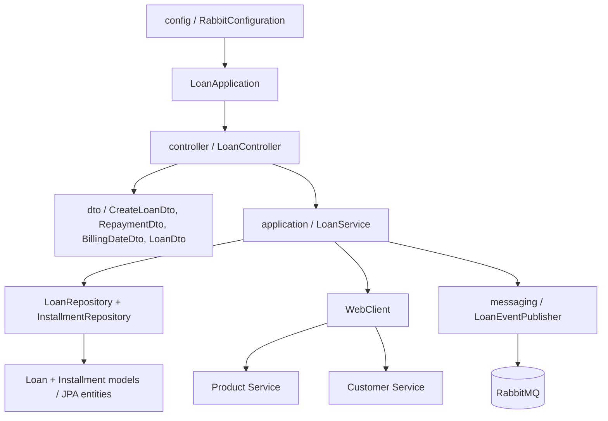

# Loan Service

Owns loan disbursement, lump-sum and installment structures, repayments, consolidated billing dates, loan states, and overdue sweeps.

## Run

Start Product and Customer Services first, then run:

```powershell
.\mvnw.cmd -pl services/loan-service spring-boot:run
```

Runs on `http://localhost:8083` and requires RabbitMQ, Product Service at `8081`, and Customer Service at `8082`.

## API

- `POST /api/loans` disburses a lump-sum or installment loan.
- `GET /api/loans` lists loans.
- `GET /api/loans/{id}` returns one loan.
- `GET /api/loans/{id}/installments` returns the billing schedule.
- `PATCH /api/loans/{id}/billing-date` sets a consolidated due date.
- `POST /api/loans/{id}/repayments` records a repayment.
- `POST /api/loans/sweep` runs overdue processing immediately.

Every `POST /api/loans` request must include a client-generated `idempotencyKey`. The key is stored with a unique database constraint. A retry with the same key returns the original loan and does not reserve customer credit or publish a second creation event. A database uniqueness constraint protects against concurrent duplicate requests; clients should retry safely after timeouts using the same key.

Loan creation calls Product Service for fee and tenure configuration and Customer Service to reserve credit. Lifecycle events are published through RabbitMQ.

## OpenAPI documentation

- Swagger UI: `http://localhost:8083/swagger-ui.html`
- OpenAPI JSON: `http://localhost:8083/v3/api-docs`

The controller uses `@Tag` and `@Operation` annotations for disbursement, repayment, installment, billing, and sweep operations.

## Project structure

```text
com/tezza/loan/
├── LoanApplication.java
├── application/
│   └── LoanService.java
├── config/
│   ├── LoanServiceProperties.java
│   └── RabbitConfiguration.java
├── controller/
│   ├── ApiExceptionHandler.java
│   └── LoanController.java
├── dto/
│   ├── BillingDateDto.java
│   ├── BillingDateRequest.java
│   ├── CreateLoanDto.java
│   ├── LoanDto.java
│   ├── LoanRequest.java
│   └── RepaymentRequest.java
├── messaging/
│   └── LoanEventPublisher.java
├── model/
│   ├── Installment.java
│   ├── Loan.java
│   └── package-info.java
└── repository/
	├── InstallmentRepository.java
	└── LoanRepository.java
```



Loan HTTP responses are DTOs, while the service uses Reactor adapters around its current blocking JPA boundary.

All HTTP operations return `Mono` or `Flux`; blocking JPA and cross-service calls are isolated on `Schedulers.boundedElastic()`. No `CompletableFuture` is used.

## Loan risk and security controls

- Idempotency prevents duplicate disbursements during client retries or gateway timeouts.
- Customer credit is reserved before the loan is persisted; failures return an error and do not publish a creation event.
- `BigDecimal` is used for monetary values and percentage fees are rounded to two decimal places.
- Request validation rejects missing identifiers, invalid principals, invalid structures, and missing idempotency keys.
- Loan and installment state changes occur inside transactions.
- Overdue processing is scheduled and can also be triggered explicitly for controlled operations.
- JWT authentication is enforced at the gateway, while downstream services are intended to remain cluster-internal.
- Config Server credentials, encryption keys, JWT secrets, and database credentials are supplied through Kubernetes/OpenShift Secrets.
- RabbitMQ events are published only after local loan persistence succeeds; production deployments should add an outbox table for crash-safe event delivery.
- Rate limiting is distributed through Redis at the gateway to reduce abuse and protect assignment endpoints.

## Coverage

Run the module tests and generate JaCoCo reports with `mvn verify`. Mockito coverage includes the duplicate-assignment path in `LoanServiceIdempotencyTest`. Full 100% project coverage cannot be honestly guaranteed without executing the complete Maven build and adding tests for every controller, configuration branch, messaging handler, and failure path; JaCoCo reports are generated so the remaining gaps are measurable.

## Resources and persistence

- `src/main/resources/application.properties` contains service URLs, PostgreSQL schema, RabbitMQ, and sweep settings.
- `src/main/resources/schema.sql` documents loan and installment tables.
- `src/main/resources/data.sql` explains why loans are not seeded without cross-service IDs.
- Production deployments use the shared PostgreSQL `loan_schema`; local development may use the H2 fallback.
- `@EnableScheduling` runs the overdue sweep using `loan.sweep.fixed-delay-ms`.
