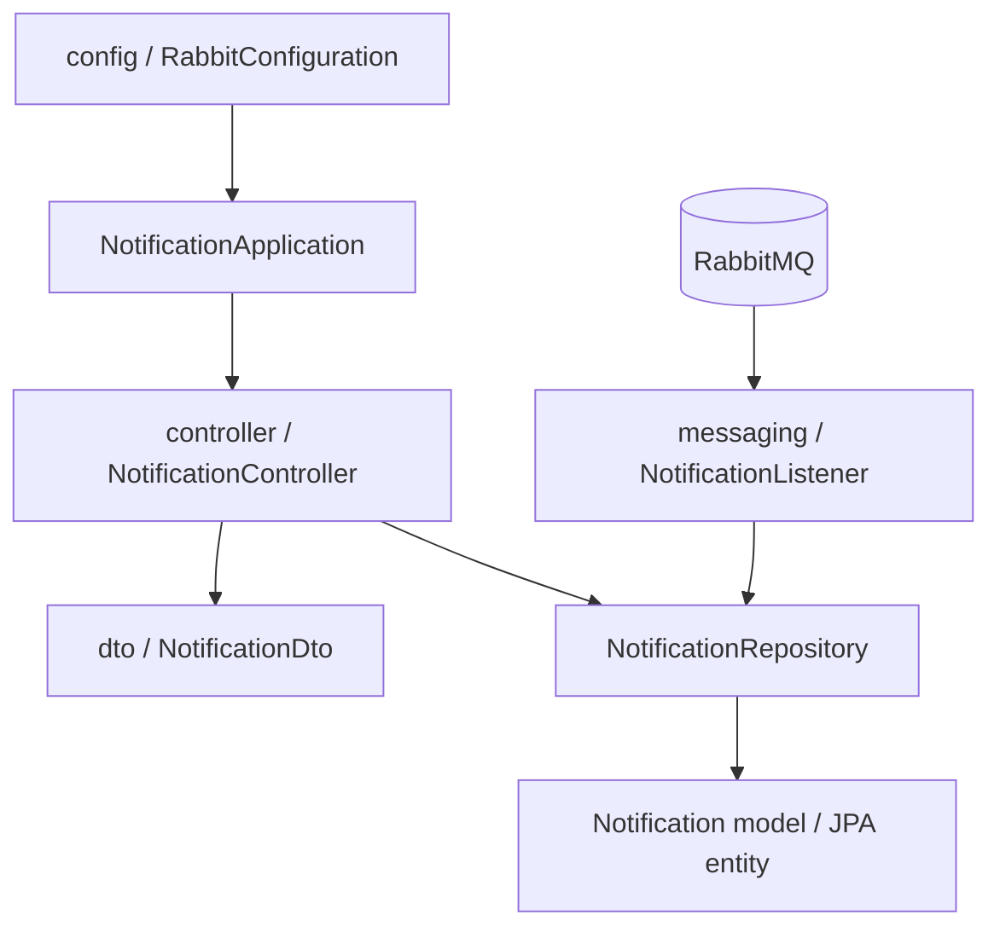

# Notification Service

Consumes RabbitMQ loan lifecycle events and stores notification history. It is the integration point for future email, SMS, and push adapters.

## Run

Start RabbitMQ, then run:

```powershell
.\mvnw.cmd -pl services/notification-service spring-boot:run
```

Runs on `http://localhost:8084` and requires RabbitMQ at `localhost:5672`.

## API

- `GET /api/notifications/customer/{customerId}` lists notifications for a customer.

## Messaging

Consumes the durable `notification.events` queue from the `tezza.events` direct exchange. Typed handlers process:

- `loan.created`
- `repayment.received`
- `loan.overdue`

## OpenAPI documentation

- Swagger UI: `http://localhost:8084/swagger-ui.html`
- OpenAPI JSON: `http://localhost:8084/v3/api-docs`

The notification controller uses `@Tag` and `@Operation` annotations for notification history retrieval.

## Project structure

```text
com/tezza/notification/
├── NotificationApplication.java
├── application/
│   └── package-info.java
├── config/
│   └── RabbitConfiguration.java
├── controller/
│   ├── ApiExceptionHandler.java
│   └── NotificationController.java
├── dto/
│   └── NotificationDto.java
├── messaging/
│   └── NotificationListener.java
├── model/
│   ├── Notification.java
│   └── package-info.java
└── repository/
	└── NotificationRepository.java
```



Notification records are created reactively at the HTTP boundary and asynchronously from typed RabbitMQ events.

The query API returns `Flux<NotificationDto>` and moves the JPA query to `Schedulers.boundedElastic()`; no `CompletableFuture` is used.

## Resources and persistence

- `src/main/resources/application.properties` contains local development, PostgreSQL schema, and RabbitMQ settings.
- `src/main/resources/schema.sql` documents the notification table.
- `src/main/resources/data.sql` explains that notifications are event-driven.
- Production deployments use the shared PostgreSQL `notification_schema`; local development may use the H2 fallback.
