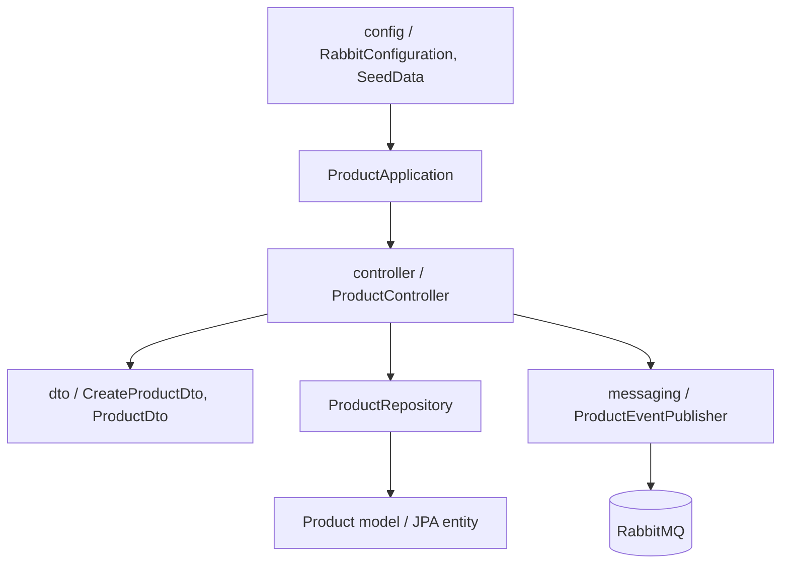

# Product Service

Owns loan product configuration and publishes `product.created` events.

## Run

From the repository root:

```powershell
.\mvnw.cmd -pl services/product-service spring-boot:run
```

Runs on `http://localhost:8081` and requires RabbitMQ at `localhost:5672`.

## API

- `POST /api/products` creates a product.
- `GET /api/products` lists products.
- `GET /api/products/{id}` returns one product.

Product configuration includes `DAYS` or `MONTHS` tenure, fixed or percentage service fees, daily fees, late fees, and late-fee trigger days.

## OpenAPI documentation

- Swagger UI: `http://localhost:8081/swagger-ui.html`
- OpenAPI JSON: `http://localhost:8081/v3/api-docs`

The controller uses `@Tag` and `@Operation` annotations to describe product resources.

## Project structure



The `dto` package is the HTTP contract; the model remains internal to Product Service and is not shared with downstream services.

Controllers expose Reactor `Mono` and `Flux` types. Existing JPA calls run on `Schedulers.boundedElastic()` at the persistence boundary; no `CompletableFuture` is used.

## Resources and persistence

- `src/main/resources/application.properties` contains local development, PostgreSQL schema, and RabbitMQ settings.
- `src/main/resources/schema.sql` documents the service-owned table.
- `src/main/resources/data.sql` documents seed ownership.
- Production deployments use the shared PostgreSQL `product_schema`; local development may use the H2 fallback.
- `SeedData` inserts demonstration products when the database is empty.
